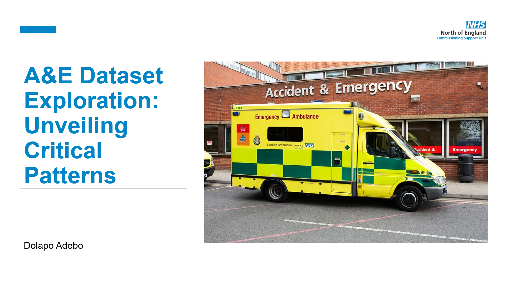

# Accident and Emergency Analysis

This project demonstrates my ability to use Python, PostgreSQL, PowerBI, and PowerPoint for data cleaning, data migration, data visualization, and reporting.

### Files:
- `AAEDataset.csv`: A dummy dataset containing cases attended to in the Accident and Emergency department over a two-year period from a specific NHS Trust.
- `csv_to_sql.py`: A Python script that transfers the entire CSV file into a PostgreSQL database.
- `data_cleaning.ipynb`: A notebook containing initial data cleaning processes.
- `discharge_to_home_sql.py`: A Python script that moves a subset of the data into a PostgreSQL database.
- `NHS NECSU.pptx`: A PowerPoint presentation containing a live PowerBI dashboard, revealing important insights.
